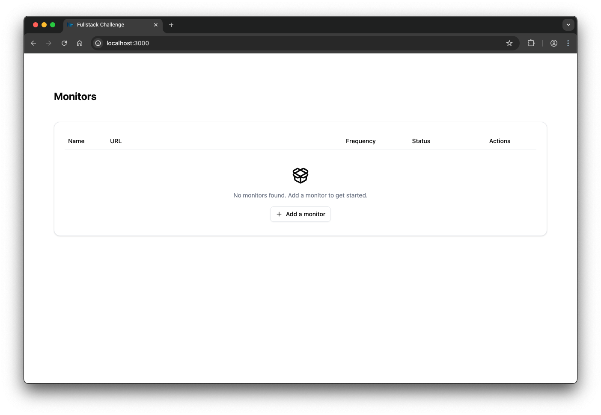
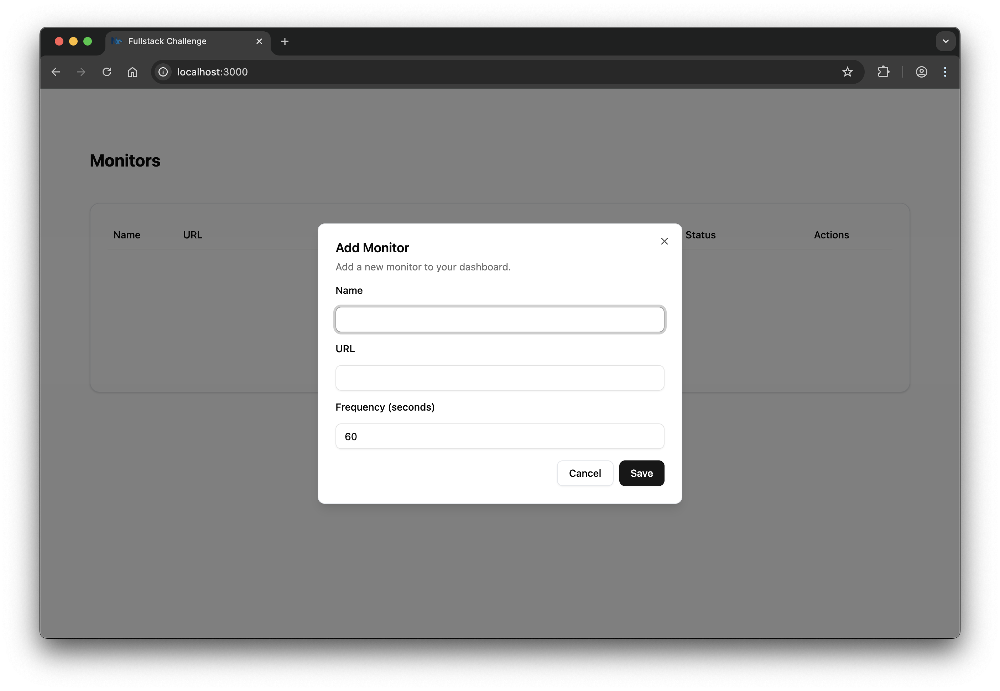
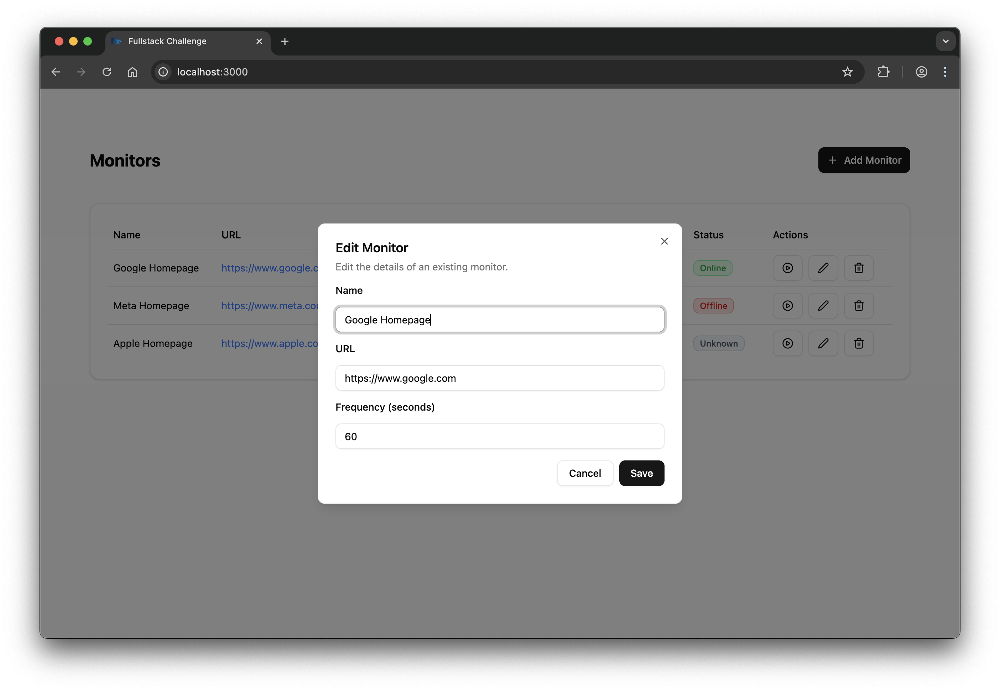
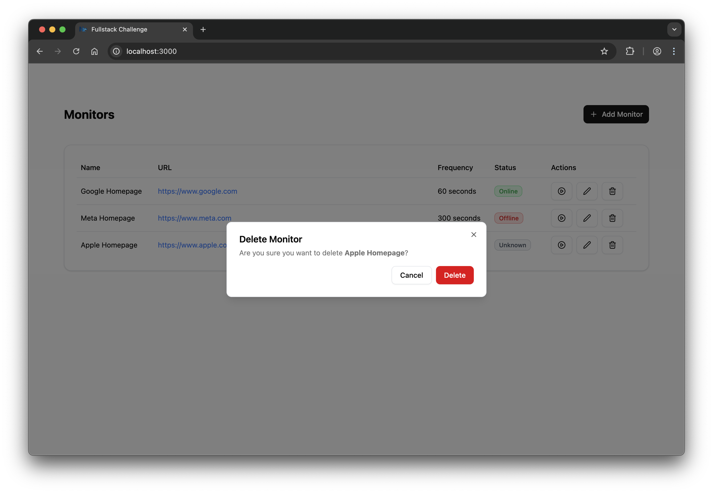
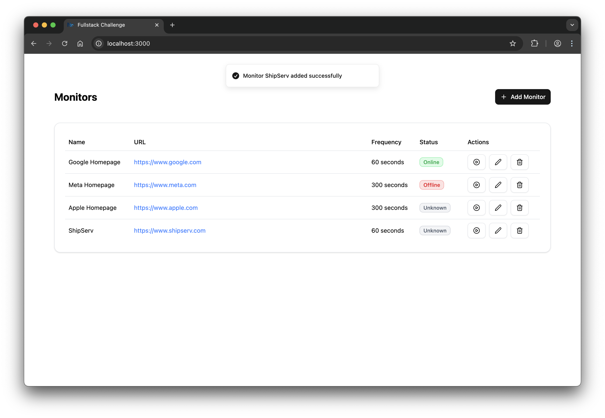
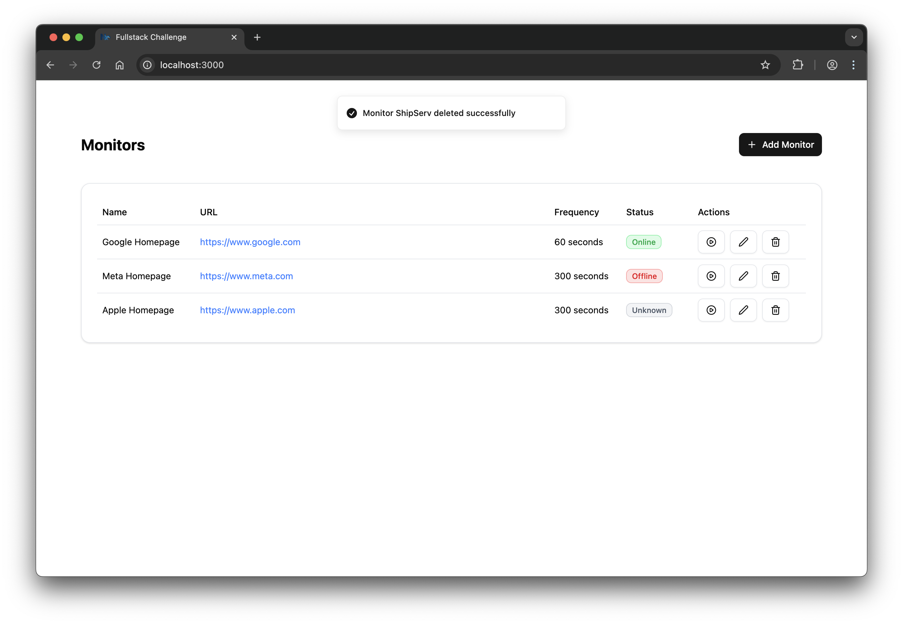

# URL Monitor – Full-Stack Interview Exercise

## Overview

Your task is to build a **minimal web application** that lets a user:

1. Create, read, update, and delete “monitors” for website URLs.
2. Automatically and manuallycheck whether each monitored URL is reachable.
3. Show the most recent status for each URL (Online, Offline, Unknown).

A **monitor** consists of:

- A **Name** (e.g., "Google Homepage")
- A **URL** (e.g., `https://www.google.com`)
- A **Frequency** (in seconds)
- A **Status** (Online, Offline, Unknown)

At the specified frequency, the system should send an HTTP `GET` request to the URL and store the result.

## Expected Deliverable

- Working application that runs locally.
- Code should be reasonably structured for readability and maintainability.
- You **do not** need production-ready auth, deployment setup, or advanced error handling.

## User Stories

**As a User**  
When I visit the frontend application in my browser  
I should be presented with the application UI  
I should see an empty state with a call to action to add my first monitor  

**As a User**  
When I visit the frontend application in my browser  
And I have added monitors  
I should see a list of my monitors  
I should be able to manually trigger a check for a monitor  
I should be able to edit the details of a monitor  
I should be able to delete a monitor  

**As a User**  
When I am viewing the list of monitors  
I should see clear, color-coded status badges (Online, Offline, Unknown, Checking)  

**As a User**  
When I am viewing the list of monitors  
I should be able to add a new monitor  

**As a User**  
When I am viewing the list of monitors  
I should be able to edit the details of a monitor  

**As a User**  
When I choose to delete a monitor  
I should be asked to confirm and then the monitor is removed from the list  

**As a User**  
When I perform add or delete a monitor
I should see a descriptive message in a toast explaining what happened (failure or success)  
  

---

### Resources

Shadcn: https://ui.shadcn.com/docs  
Lucide icons: https://lucide.dev/icons/
